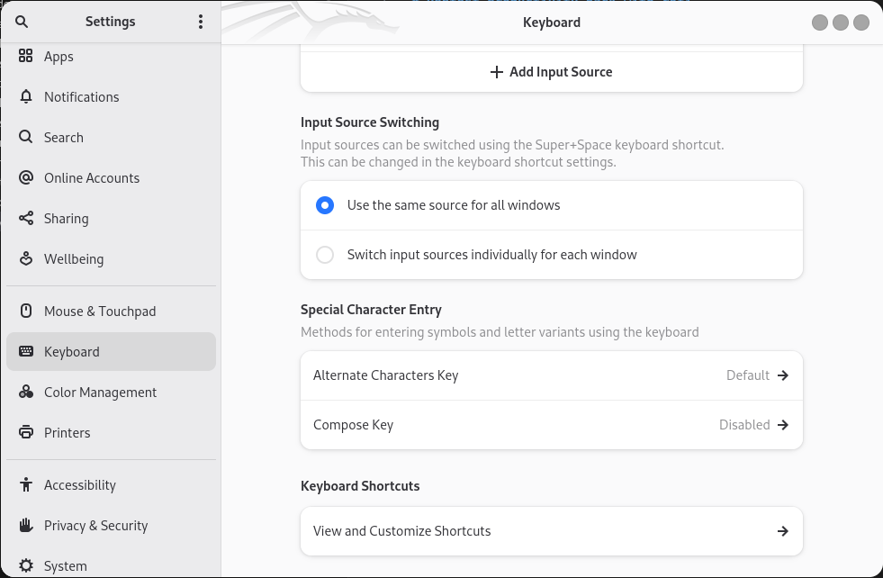
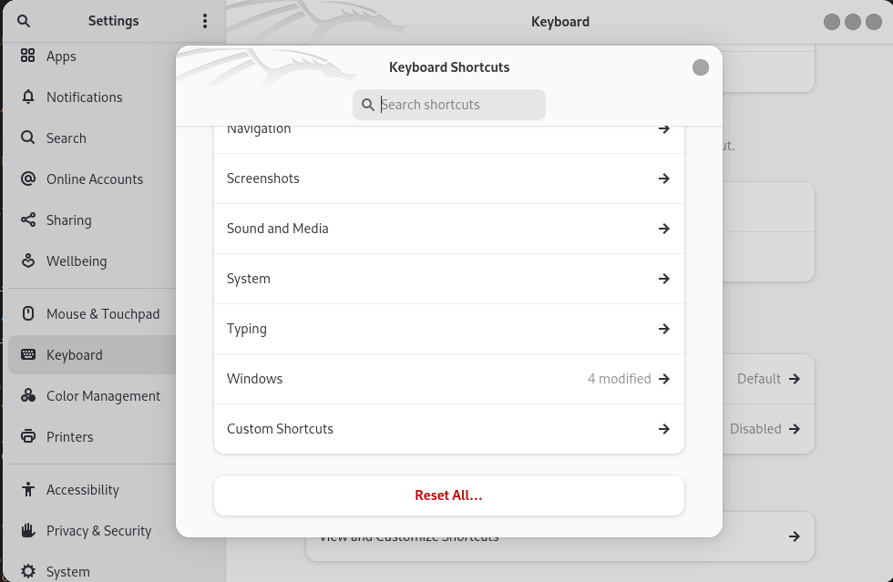
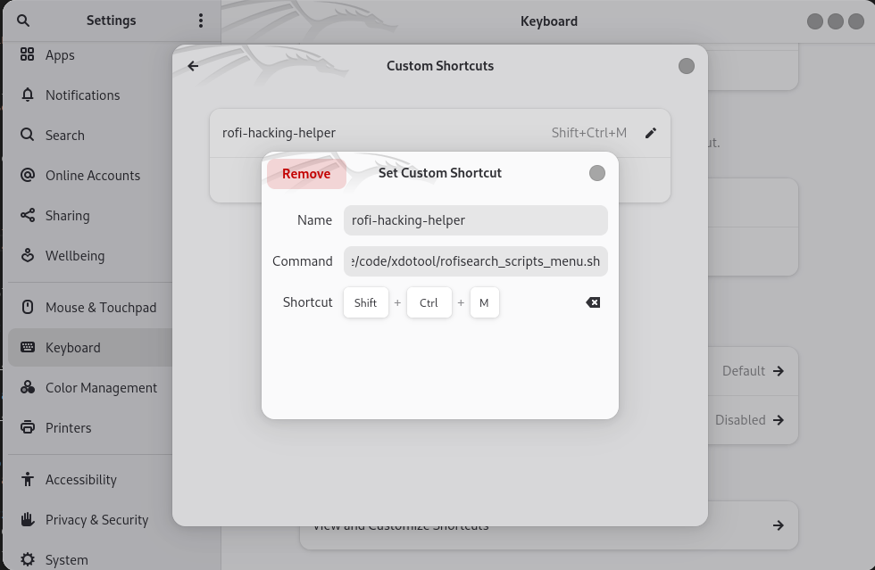
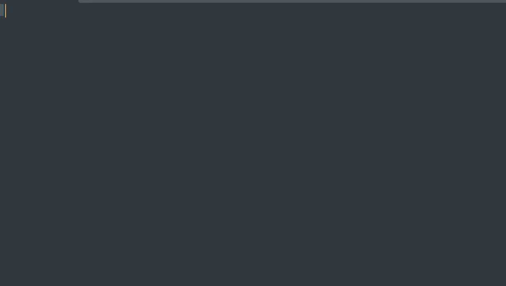

# Pentest Productivity Hack with Rofi

Automate typing and run background tasks in Kali Linux using Rofi and xdotool. It works in arbitrary applications (RDP sessions, browsers, any shell, etc.). This tool enhances your productivity by making frequently used scripts quickly accessible through a Rofi menu.

## Installation

### Super Quick Installation (Automated)

Instead of the usual steps, you can directly fetch the installation script from GitHub and pipe it to Bash. This saves time and simplifies the installation process.

1. Download and run the install script directly:

   ```bash
   bash <(curl -s https://raw.githubusercontent.com/dvdknaap/rofi-hacking-helper/main/install.sh)
   ```

This will automatically configure everything, including downloading the repository and installing the necessary tools.

### Manual Installation

If you prefer to install it manually, follow these steps:

1. **Clone the repository**:

   ```bash
   git clone https://github.com/dvdknaap/rofi-hacking-helper.git ~/Desktop/base
   cd ~/Desktop/base
   ```

2. **Install Rofi** (if not already installed):

   ```bash
   sudo apt install rofi xdotool python3 python3-tk powershell xclip -y
   ```

3. **Add the Rofi script as a keyboard shortcut**:

   - Go to `Settings Manager` -> `Keyboard` -> `Application Shortcuts` / `Keyboard Shortcuts`:
   
   

   - Scroll down and click on `Custom Shortcuts`:
   
   

   - Click 'Add' and fill in the following details:

     **Name**: `rofi-hacking-helper`  
     **Command**: `/home/username/Desktop/base/code/xdotool/rofisearch_scripts_menu.sh` (replace `username` with your actual username, `~/` won't work)  
     **Shortcut**: Set it to `Ctrl+Shift+M` to execute scripts from anywhere.

   

### What It Looks Like



#### Fully Automatic Shell Fix
[Full-size video](assets/shellFix.mp4)
https://github.com/dvdknaap/rofi-hacking-helper/blob/main/assets%2FshellFix.mp4


---

## Documentation of Scripts

You can find the list of available scripts and their descriptions in the `documentation/script_list.md` file. This document provides an overview of all the available scripts and how they can be used to boost your pentesting productivity.

[View the Script List Documentation](documentation/script_list.md)

## Tips

- Add **IP addresses**, **domains**, and **credentials**, and the system will automatically generate custom code that can be used in the Rofi menu:  
  [dvdknaap/add-creds-rofi](https://github.com/dvdknaap/add-creds-rofi)

## Limitations

- xdotool doesn't work under Wayland, so it works in Kali but not on Ubuntu.
- Because it is application-independent, it doesn't share your normal shell aliases.

## To-Do

- A generic typing helper would improve readability and potentially make the scripts adaptable to Wayland.

## Other Productivity Tips

Check out [productivity tips](Productivity.md) for more general productivity tips for Kali Linux.

---

## Forked and Special Thanks to @spipm

[spipm/rofi-hacking-helper Repository](https://github.com/spipm/rofi-hacking-helper)
